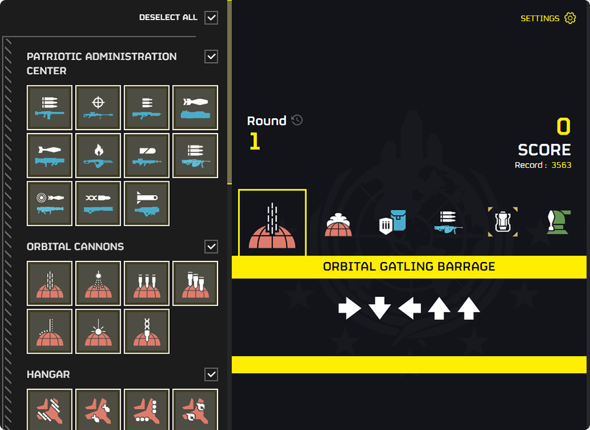
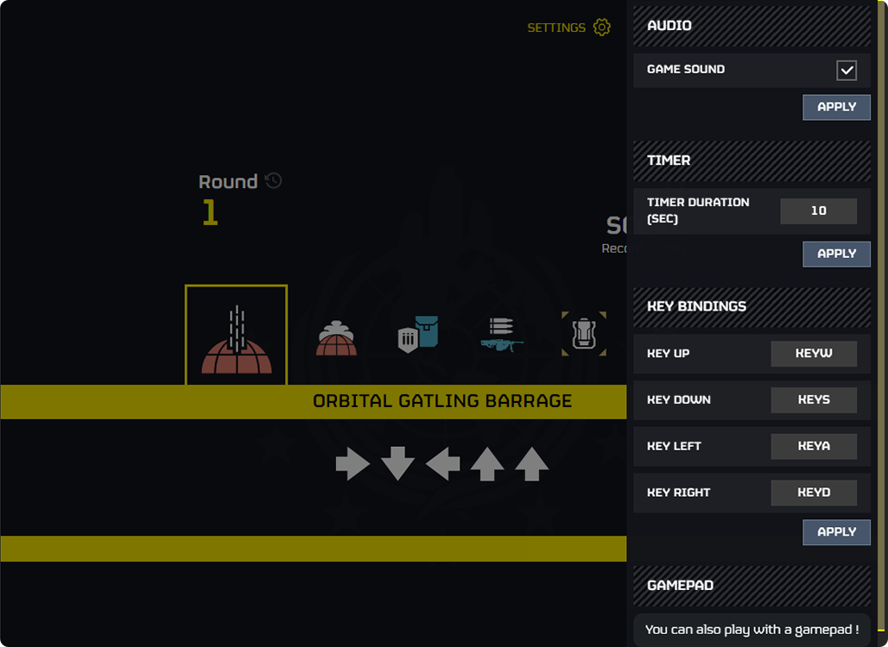
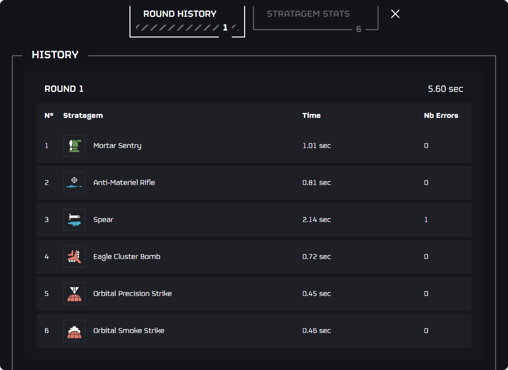

# [Stratagem Hero Trainer](https://stratagem-hero-trainer.vercel.app/)

Turning Average Joes into Stratagem Superstars, Because Even Bugs Fear a Well-Placed Stratagem!

[Stratagem Hero Trainer](https://stratagem-hero-trainer.vercel.app/) 🎮🤖

## Description

Stratagem Hero Trainer is an advanced web application designed to enhance strategic skills through immersive training modules. It provides personalized training plans, real-time feedback, and performance tracking to transform beginners into strategic experts.

## Features

- **Interactive Training Modules**: Engage in dynamic and interactive sessions designed to boost strategic thinking.
- **Real-time Feedback**: Receive instant feedback on your performance to aid continuous improvement.
- **Customizable Training Plans**: Tailor your training schedule to fit your personal goals and progress.
- **Leaderboards**: Compete with others and see where you rank among the top performers.
- **User-friendly Interface**: Navigate the application with ease thanks to an intuitive and streamlined design.

## Screenshots

#### Stratagem hero

#### Settings

#### History & Stats

# Support me

### If you find these resources helpful for your projects or simply enjoy the designs, consider supporting my efforts.

